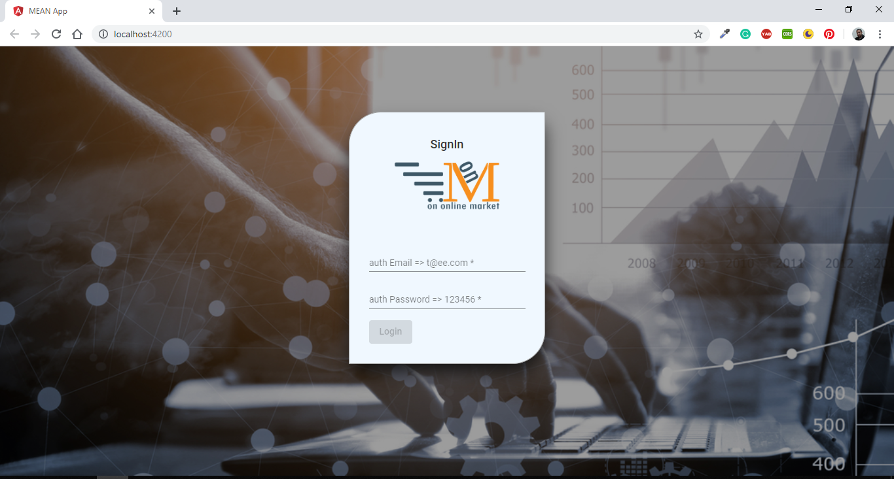
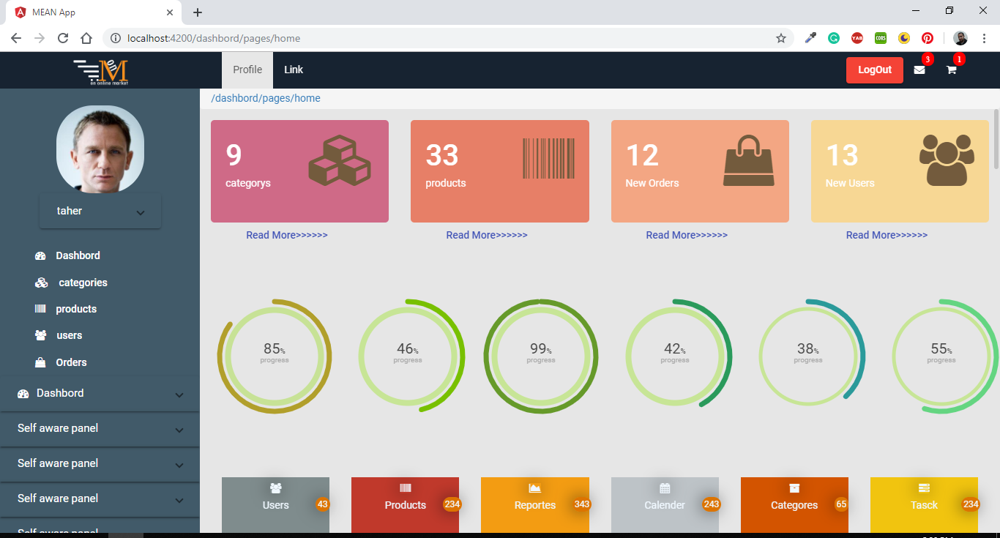
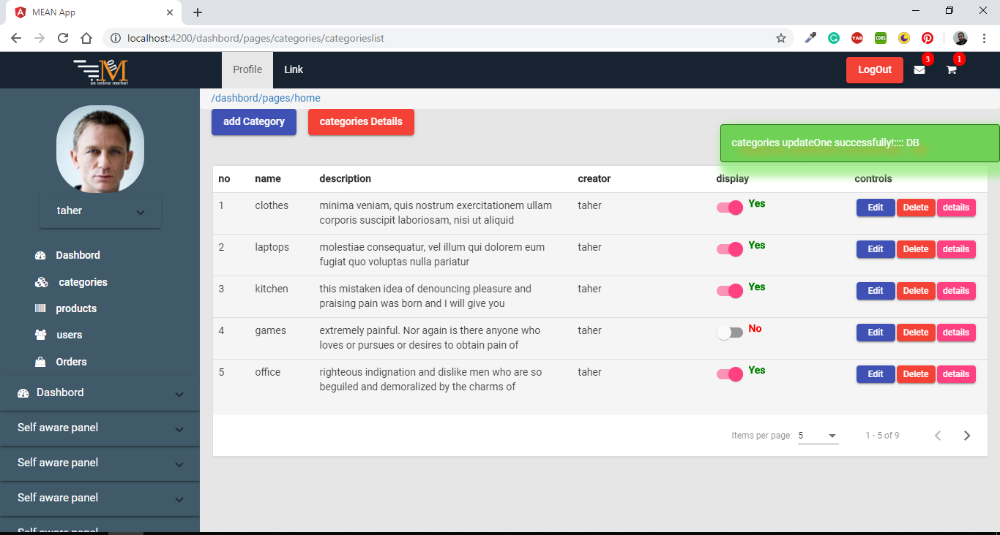
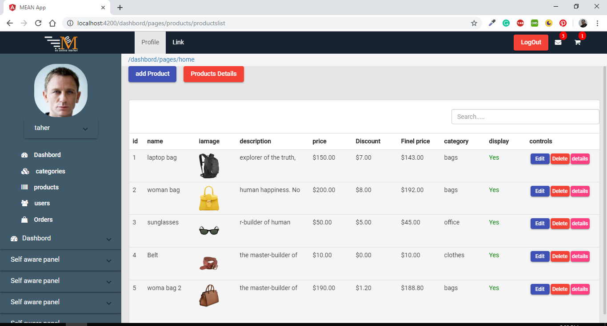
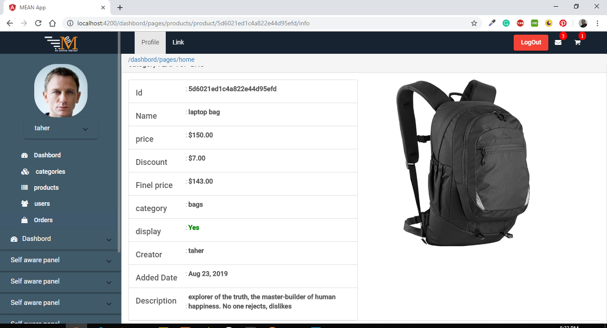
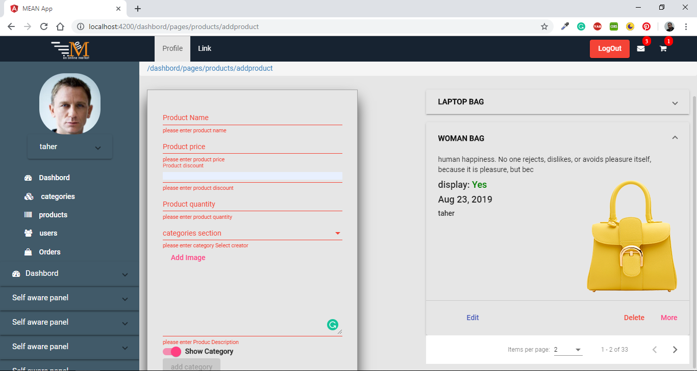
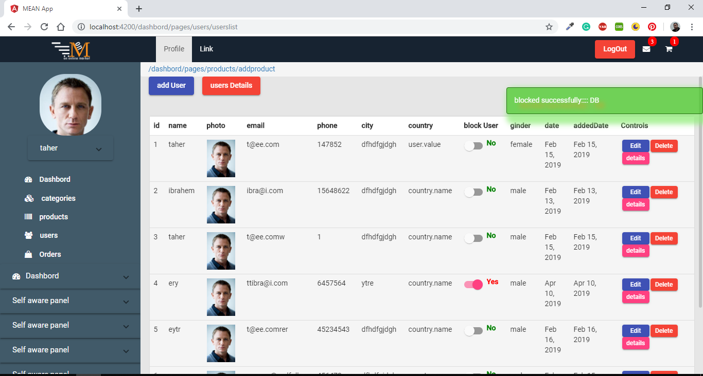
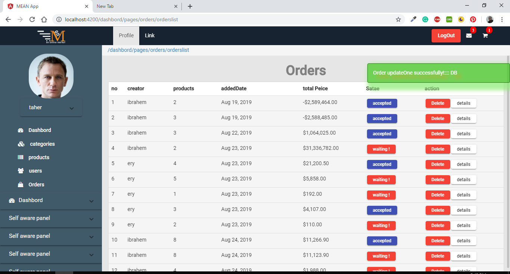
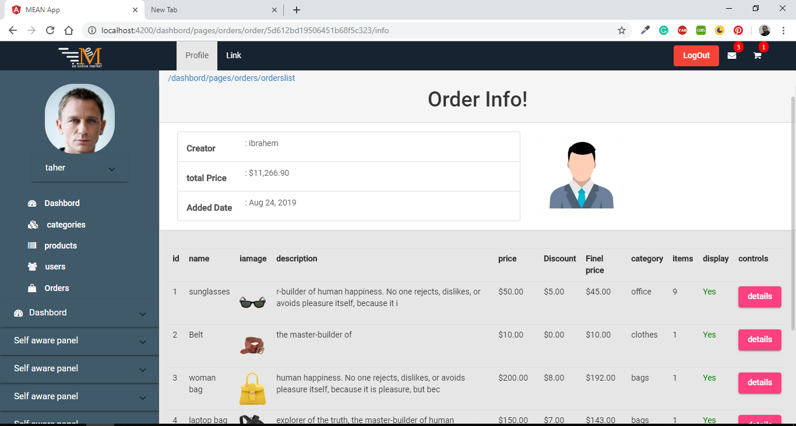
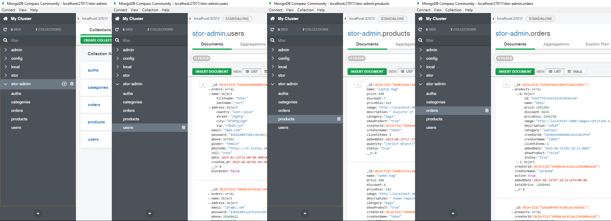

<h1> e-Cpmmerce Admin Panel </h1>
<h3> backend </h3>

<h2>what i use in this project</h2>

this project is e-Commerce kind created by node angular express mongoDB

<ul>
  <li>CRUD operations</li>
  <li>Image Uploads</li>
  <li>Pagination</li>
  <li>User Authentication</li>
  <li>Authorization</li>
  <li>Handling Errors</li>
  <li>send meals</li>
  <li>restful api</li>
</ul>

<h5>Login</h5>

<h5> Dashbord </h5>

<h5> Categories List </h5>

<h5> Products List</h5>

<h5> Product Info </h5>

<h5> Add Product With Input Validation</h5>

<h5> Users List</h5>

<h5> Orders List</h5>

<h5> Order Info</h5>

<h5> MongoDB View</h5>

<h5>Auth Info</h5>
<ul>
  <li>name: taher Ahmed </li>
  <li>phone: 01155721425 / 01550314558 </li>
</ul>
# Backend-MEAN-Stack
